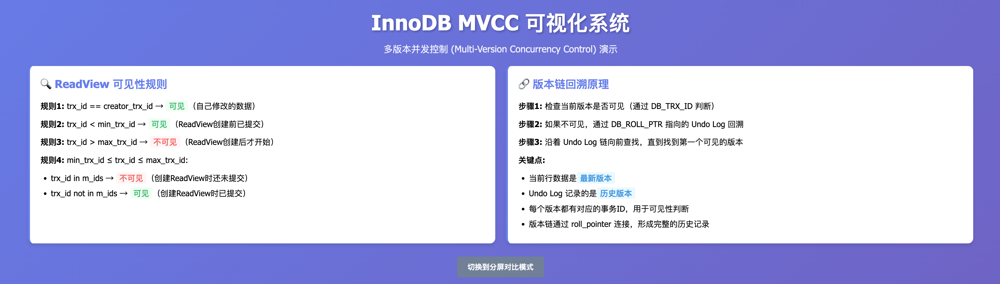
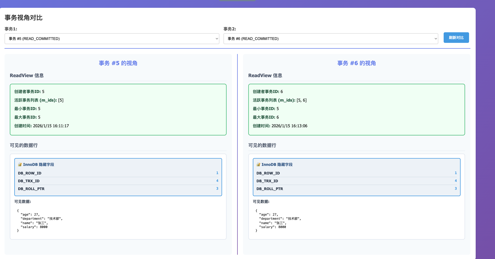
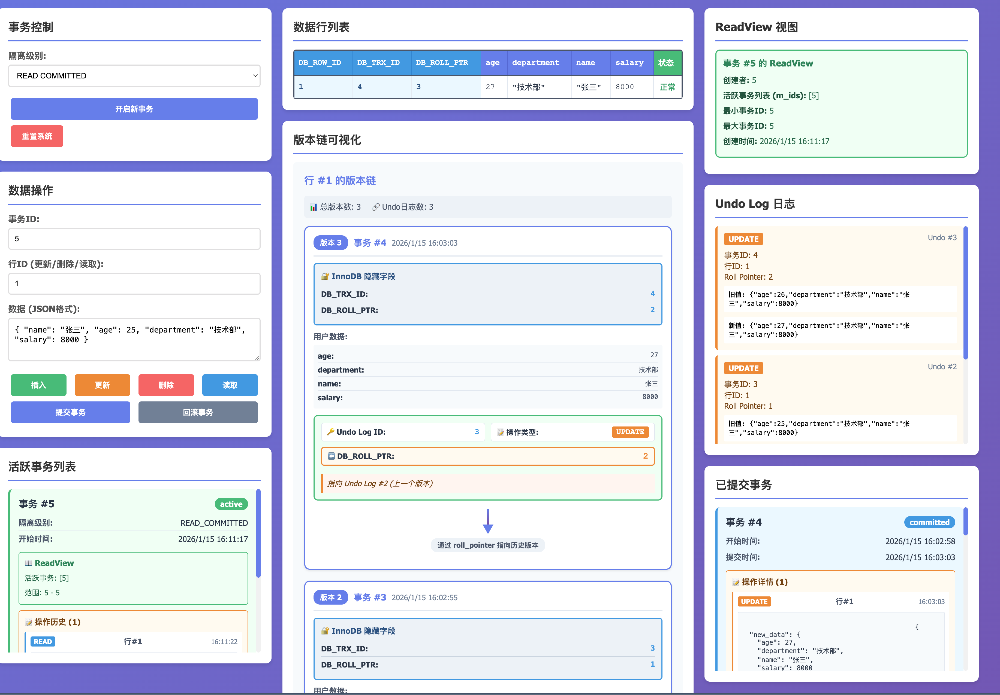

# InnoDB MVCC 可视化系统

一个用于教学与演示的 InnoDB MVCC（多版本并发控制）可视化 Web 应用，包含事务、ReadView、Undo Log、版本链与可见性判断等核心概念的直观展示。

## 功能亮点

- 事务管理：开启、提交、回滚，支持 `READ COMMITTED` 与 `REPEATABLE READ`
- 数据操作：插入、更新、删除、读取，并记录操作历史
- ReadView 可视化：展示活跃事务列表、`min_trx_id`、`max_trx_id`
- 版本链与 Undo Log 展示：跟踪 `roll_pointer` 回溯路径
- 读取路径追踪：读操作可弹窗显示可见性判断过程并支持导出
- 分屏对比视图：同时对比两个事务的 ReadView 与可见数据
- 一键重置：清空系统状态，便于重复演示

## 快速开始

### 1. 安装依赖

```bash
pip install -r requirements.txt
```

### 2. 启动服务

```bash
python app.py
```

默认访问地址：`http://127.0.0.1:5001`

## 使用说明

### 基本流程示例

1. 开启事务（可选择隔离级别）
2. 使用事务 ID 进行插入/更新/删除
3. 读取数据，查看可见性判断结果
4. 通过版本链和 Undo Log 观察历史版本
5. 提交或回滚事务

### 读取路径追踪

- 勾选“显示读取路径追踪弹窗”后执行读取
- 弹窗中展示当前版本与 Undo 日志链的可见性判断
- 点击“导出路径”可下载追踪报告

### 分屏对比

- 点击右上角“切换到分屏对比模式”
- 选择两个事务进行对比查看 ReadView 与可见数据

## 项目结构

```
Innodb-mvvc-visualization/
├── app.py                      # Flask Web 入口与 API
├── mvcc_system.py              # MVCC 逻辑整合
├── transaction.py              # 事务与 ReadView
├── data_row.py                 # 数据行、版本链
├── undo_log.py                 # Undo Log
├── templates/
│   └── index.html              # 前端页面
├── static/
│   ├── js/
│   │   └── app.js              # 前端交互逻辑
│   └── css/
│       └── style.css           # 样式
├── requirements.txt            # 依赖
└── README.md
```

## API 简览

- `POST /api/transaction/begin` 开启事务
- `POST /api/transaction/commit` 提交事务
- `POST /api/transaction/rollback` 回滚事务
- `POST /api/data/insert` 插入数据
- `POST /api/data/update` 更新数据
- `POST /api/data/delete` 删除数据
- `POST /api/data/read_with_path` 读取数据并返回路径
- `GET /api/system/state` 获取系统状态
- `POST /api/system/reset` 重置系统

## 截图






